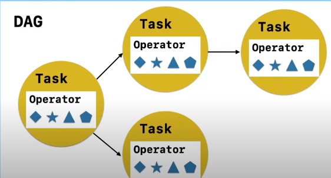
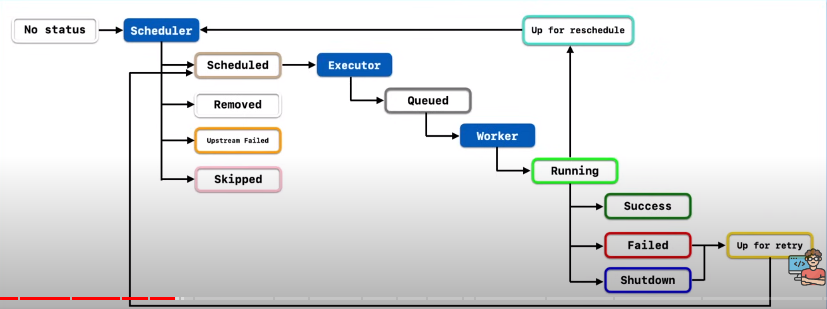
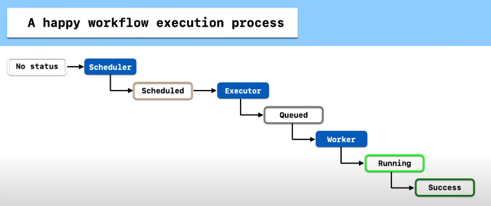
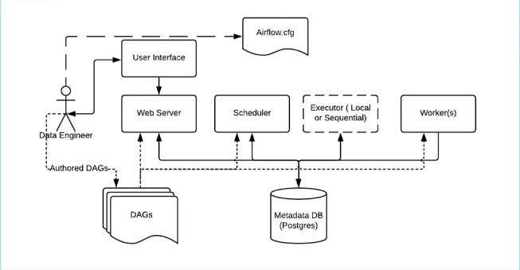

# Airflow


## Setup

1. Create a git directoty for practise and clone it
2. Create a pipenv environment and install req dependencies - `pipenv install --python=3.7 Flask==1.0.3 apache-airflow==1.10.3`
3. We setup airflow home dir in an env file - `echo "AIRFLOW_HOME=${PWD}/airflow" >> .env`
4. Airflow req a db to run, by default it uses a sqlite db for this process - `airflow initdb`
5. Then we create a folder to setup our dags - `mkdir -p ${AIRFLOW_HOME}/dags/`
6. Run airflow - `airflow webserver -p 8081`
7. Start airflow scheduler - `airflow scheduler`
8. Run task from a dag - `airflow run <dag> <task> 2020-05-31`
9. List tasks in a dag - `airflow list_tasks <dag>`
10. Pause and unpause dag - `airflow pause/unpause <dag>`

### Workflow
1. Workflow is a sequence of events, in airflow we represent workflow as a directed acyclic graph
2. A task is a unit of work in a dag. It is represented as a node in graph
3. The goal of a task is to achieve something, the method it uses to achieve it is called an operator. eg BashOperator, PythonOperator, Custom Operators etc

4. A task instance is the execution of a task run at a date

### Task Lifecycle



### Airflow Architecture


## DAGs
In airflow, DAGs are defined as python files in the `dags/` folder.

### First DAG with BashOperator

```
from airflow import DAG
from airflow.operators.bash import BashOperator
from datetime import datetime, timedelta

# Common Parameters to intiate the operator
default_args = {
    "owner": "raghu",
    "retries": 5,
    "retry_delay": timedelta(minutes=5),
}

# Create an instance of DAG
with DAG(
    dag_id = "my_first_dag_v1", # id of dag
    description = "demo first dag", # description
    default_args = default_args, # default parameters of dag
    # parameters for start date and interval
    start_date = datetime(2024, 2, 1, 2), # start from 2024 feb 1 everyday at 2am
    schedule_interval = "@daily", # everyday

) as dag:
    task1 = BashOperator(
        task_id = "first_task",
        bash_command = "echo This is the first task"
    )
    task2 = BashOperator(
        task_id = "second_task",
        bash_command = "echo This is the second task, this is run after the first task"
    )
    task3 = BashOperator(
        task_id = "thid_task",
        bash_command = "echo This is the third task, this is run after the first task, parallel to second task"
    )

    # This is one way to setup the dependencies
    task1.set_downstream(task2)
    task1.set_downstream(task3)

    # This is another way to setup the dependencies
    task1 >> task2
    task1 >> task3

    # This is the last way
    task1 >> [task2, task3]
```

### DAG with PythonOperator
```
from airflow.operators.python import PythonOperator

def greet(name, age):
    print(f"My name is {name} and I am {age} years old")

task_1 = PythonOperator(
        task_id = "greet_fn",
        python_callable = greet,
        op_kwargs = {"name": "Raghu", "age": 22}
    )

    task_1
```


### XComs
1. We can share data between tasks using XComs
2. Basically we push data from one task to XCom and pull it from there by another task
3. By default, all return values from functions are pushed to XComs
4. We do not use XComs to share large data, we use it to share metadata, the max limit of xcom is 48kb, although it varies with the backend db
5. We use `ti` or also called, task instance object to pusha and pull data from XComs, we use xcom_push and xcom_pull methods of ti object.
```
from airflow.operators.python import PythonOperator

def greet(ti):
    # pull data from ti
    name = ti.xcom_pull(task_ids = "get_name", key = "name")
    age = ti.xcom_pull(task_ids = "get_age", key = "age")

    print(f"My name is {name} and I am {age} years old")

def returns_name(ti):
    # we can simply return like this return {"name": "Raghu"}
    # push data
    ti.xcom_push(key="name", value="Raghu")

def returns_age(ti):
    # push data
    ti.xcom_push(key="age", value=22)

task_1 = PythonOperator(
        task_id = "get_name",
        python_callable = returns_name,
    )
    task_2 = PythonOperator(
        task_id = "get_age",
        python_callable = returns_age,
    )
    task_3 = PythonOperator(
        task_id = "greet",
        python_callable = greet,
    )

    [task_1, task_2] >> task_3
```